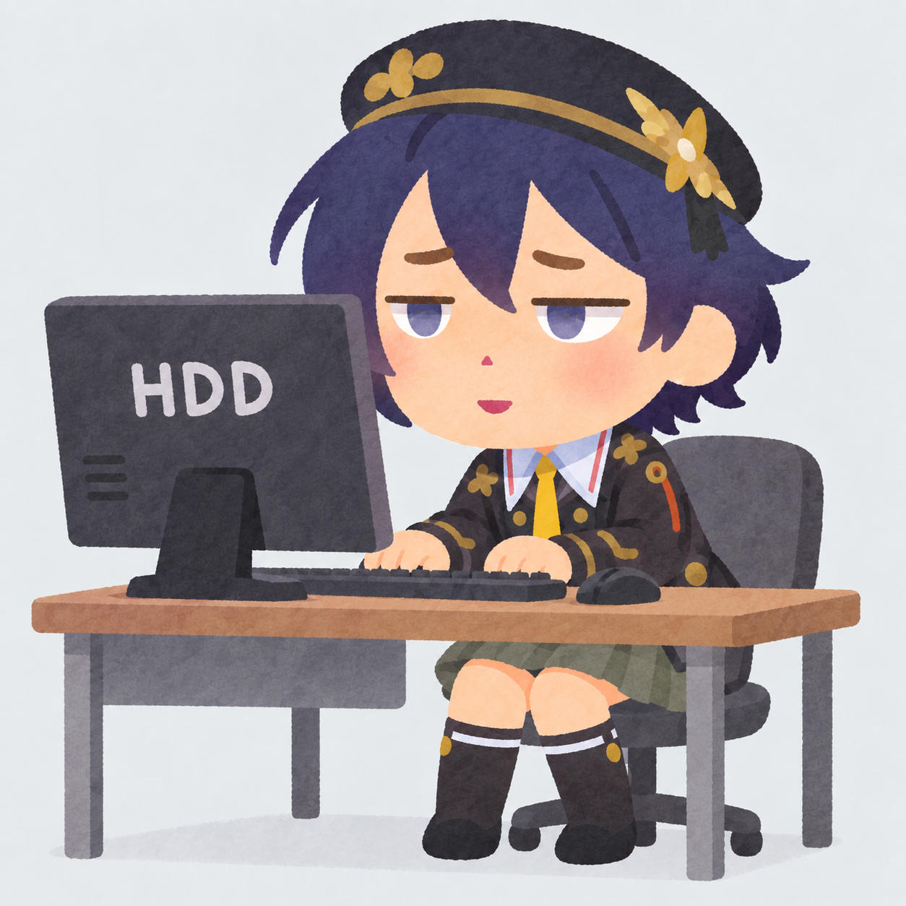

<div align="center">



# Phaethon

**[中文](#中文) | [English](#english)**

串流隐私遮罩 · Streaming privacy overlay for Sunshine / Moonlight

</div>

---

<!-- 中文版 -->

## 中文

Phaethon 在你通过 **Sunshine / Moonlight 串流**时，让电脑的**实体显示器只显示纯黑或指定的图片**，而串流画面**不受影响**——Moonlight 那端看到的始终是真实桌面，键盘鼠标操作也一切照旧。

旁边的人只能看到一块黑屏（或你设置的图片），游戏和桌面内容只存在于串流画面里。

### 原理

在每块实体显示器上放一个纯黑/图片的置顶窗口，并调用
`SetWindowDisplayAffinity(hwnd, WDA_EXCLUDEFROMCAPTURE)`（Windows 10 2004+ 官方 API）把该窗口从系统级屏幕捕获中排除。窗口不抢焦点、鼠标穿透、不进任务栏和 Alt+Tab，程序退出或崩溃时窗口自动消失。

### 功能

- **纯黑遮罩** 或 **图片幻灯片**（jpg/png/bmp/gif，cover 方式铺满，30 秒轮播）
- **多显示器**：支持负坐标、混合 DPI、主屏标记，可只遮其中任意几块
- **托盘菜单**（中英双语，跟随系统语言）：开关、选择屏幕、更换图片文件夹
- **全局热键**：`Ctrl+Alt+Shift+B` 开关 · `Ctrl+Alt+Shift+F10` 紧急关闭
- **CLI**：`on / off / toggle / status / images / exit`，未启动后台时自动拉起
- **Sunshine 联动**：通过 `global_prep_cmd` 在串流开始/结束时自动开关

### 快速开始

```text
Phaethon.exe                     启动后台实例（托盘图标）
Phaethon.exe on                  遮罩全部屏幕
Phaethon.exe on --images D:\pic  图片幻灯片模式
Phaethon.exe on --monitor 2      只遮指定屏幕
Phaethon.exe off                 关闭
Phaethon.exe status              状态
```

### Sunshine 配置

在 `global_prep_cmd` 中加入：

```json
{
  "do": "\"C:\\Tools\\Phaethon\\Phaethon.exe\" on",
  "undo": "\"C:\\Tools\\Phaethon\\Phaethon.exe\" off",
  "elevated": false
}
```

图片模式把路径写进 `do`：`... on --images C:\\Pictures\\privacy`。
Sunshine 侧建议 `capture = ddx`。

### 构建

需要 Visual Studio（含 MSVC C++ 工具集）与 Windows SDK，无第三方依赖：

```bat
build.bat
```

产物为 `build\Phaethon.exe`，静态链接，单文件即可部署。

### 限制

- 本工具用于本地串流场景，**不是 DRM 或安全边界**，无法抵御内核级捕获或直接拍摄屏幕
- UAC / Ctrl+Alt+Del / 锁屏等 Secure Desktop 界面无法被遮盖（Windows 安全模型）
- 独占全屏（Exclusive Fullscreen）游戏可能盖住遮罩，建议游戏使用无边框窗口模式

## English

<div align="right">

*(see below)*

</div>

---

<!-- English version -->

<a id="english"></a>

Phaethon shows **solid black (or your own images) on the physical monitors** while you are streaming with **Sunshine / Moonlight**. The stream itself is unaffected — Moonlight keeps showing the real desktop, and keyboard/mouse input works as usual.

People next to the machine only see a black screen (or your images); the actual content lives only in the stream.

### How it works

A topmost black/image window is placed on each physical monitor and excluded from system-level screen capture with
`SetWindowDisplayAffinity(hwnd, WDA_EXCLUDEFROMCAPTURE)` (official API, Windows 10 2004+). The window never takes focus, passes mouse events through, stays out of the taskbar and Alt+Tab, and disappears automatically when the process exits or crashes.

### Features

- **Solid black overlay** or **image slideshow** (jpg/png/bmp/gif, cover-fit, 30 s rotation)
- **Multi-monitor**: negative coordinates, mixed DPI, per-monitor selection
- **Tray menu** (English/Chinese, follows system language): toggle, screen picker, image folder
- **Global hotkeys**: `Ctrl+Alt+Shift+B` toggle · `Ctrl+Alt+Shift+F10` panic off
- **CLI**: `on / off / toggle / status / images / exit`; auto-starts the background instance
- **Sunshine integration** via `global_prep_cmd`

### Quick start

```text
Phaethon.exe                     start background instance (tray icon)
Phaethon.exe on                  cover all screens
Phaethon.exe on --images D:\pic  image slideshow mode
Phaethon.exe on --monitor 2      cover a single monitor
Phaethon.exe off                 stop
Phaethon.exe status              status
```

### Sunshine setup

Add to `global_prep_cmd`:

```json
{
  "do": "\"C:\\Tools\\Phaethon\\Phaethon.exe\" on",
  "undo": "\"C:\\Tools\\Phaethon\\Phaethon.exe\" off",
  "elevated": false
}
```

For image mode append the folder: `... on --images C:\\Pictures\\privacy`.
`capture = ddx` is recommended on the Sunshine side.

### Building

Requires Visual Studio (MSVC C++ toolset) and the Windows SDK. No third-party dependencies:

```bat
build.bat
```

Output: `build\Phaethon.exe`, statically linked, single-file deployment.

### Limitations

- Designed for local streaming only; **not a DRM or security boundary** — kernel-level capture or filming the screen is out of scope
- Secure Desktop surfaces (UAC, Ctrl+Alt+Del, lock screen) cannot be covered (Windows security model)
- Exclusive-fullscreen games may cover the overlay; borderless windowed mode is recommended
